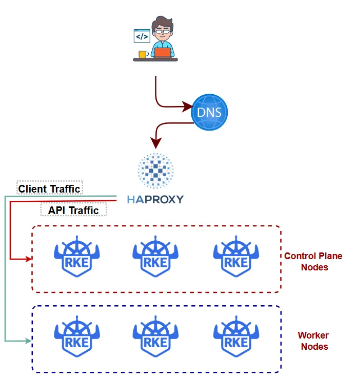

# Setting up RKE2 cluster with high availability

This guide will walk you through the process of setting up a RKE2 cluster with Ansible, in high availability mode. RKE2 is Rancher's enterprise-ready next-generation Kubernetes distribution.  It delivers upstream‑compatible Kubernetes with built‑in security hardening, compliance‑friendly by defaults, and a simple operational model that scales cleanly from data center to edge.

## Prerequisites

Before you begin, you will need to have a machine to orchestrate this process. Once you have idenitfied that machine, you'll need to have the following tools installed on the system:

- Ansible 2.21.3
  
The next requirement is the cluster. You will need to obtain 7 machines for the cluster.  Although this guide uses 7, the minimum is 5. You can adjust the number of agent nodes as needed. The specifications of those machines shall be as follows...
- 1 machine for RKE2 registration. Will serve as an external load balancer
  - OS: Rocky Linux 9
  - Memory: 2GB minimum
  - Storage: 10GB minimum
- 3 machines for RKE2 servers
  - OS: Rocky Linux 9
  - Memory: 4GB minimum (8GB recommended)
  - Storage: 30GB minimum
- 3 machines for agents.  The required resources for the agents will ultimately depend on the planned workload.
  - OS: Rocky Linux 9
  - Memory: 8GB (or what to appropiate for the work load)
  - Storage: 100GB (or what to appropiate for the work load)

#### Example Topology:



## Installation

To set up RKE2 using Ansible playbooks, follow these steps:

1. Edit the 'inventory.ini' file:
   
    With the IP addresses of the target cluster host in hand, update the inventory file.  Replace the IP addresses in the file with the IP addresses of your host. If needed, you may add more workers to the workers section.  However, in order to ensure high availability and robustness of the cluster, there must be 3 masters nodes.

2. Create certificates for use by the RKE2 registration server:

    The RKE2 registration server is the way a user will interact with the cluster.  The external communication requires TLS certificates.  Existing certificates can be used, however if self signed certificates are required for testing/development reasons, use the following commands.

    ```
    bash create-certs.sh
    ```

    This command should produce two certificate files in the 'certs' folder.

3. Download RKE2 artifact for "air gapped" installations:
   
    Some environments present challenges during installation due to internet restrictions.  Setting up a RKE2 cluster involves a lot of downloads and communication with internet servers. A solution for installing in internet restricted environments is to download the artifacts prior to installation and then copy them to the nodes. 

    ```
    bash download-artifacts.sh
    ```

    This command should produce a 'local_artifacts' folder containing RKE2 artifacts to distribute to the cluster's nodes.  This should help when installing in environments in which external internet access is limited.

4. Prepare the cluster nodes for Ansible:

    Ansible will need to execute commands against the cluster nodes.  We setup certificate-based logins using the host key of the ansible controller host, therefore logins from the ansible controller host are password-less.  In addition, the host file is modified to reference all cluster nodes by names and IP addresses.

    ```
    bash setup-nodes.sh -i inventory.ini -p <passwd>
    ```

5. Run the playbook:

    ```
    ansible-playbook playbook.yaml -i inventory.ini
    ```

   The total running time of this playbook varies based on the infrastructure.  
